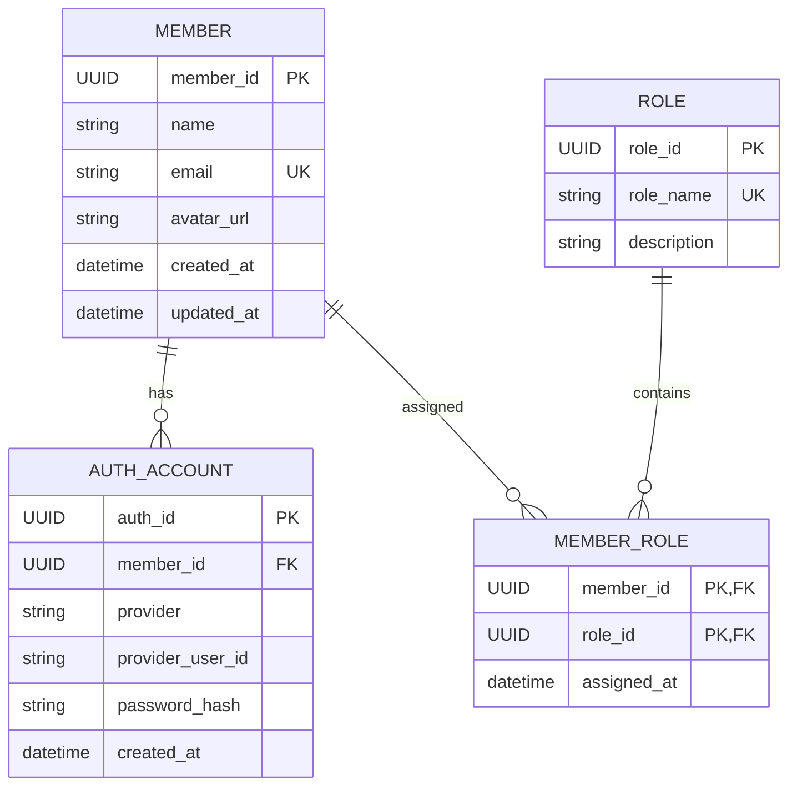

# Identity Service – ER Diagram

```mermaid
erDiagram
    MEMBER ||--o{ AUTH_ACCOUNT : has
    MEMBER ||--o{ MEMBER_ROLE : assigned
    ROLE ||--o{ MEMBER_ROLE : contains

    MEMBER {
        UUID member_id PK
        string name
        string email UK
        string avatar_url
        datetime created_at
        datetime updated_at
    }

    AUTH_ACCOUNT {
        UUID auth_id PK
        UUID member_id FK
        string provider
        string provider_user_id
        string password_hash
        datetime created_at
    }

    ROLE {
        UUID role_id PK
        string role_name UK
        string description
    }

    MEMBER_ROLE {
        UUID member_id PK, FK
        UUID role_id PK, FK
        datetime assigned_at
    }
```
